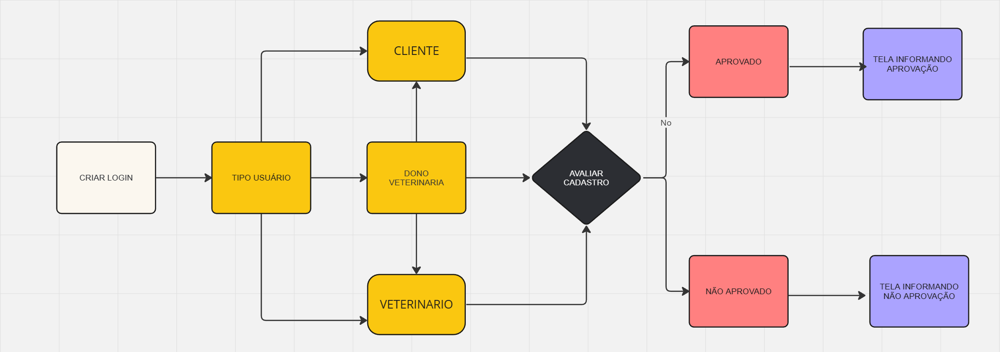

# Especificações do Projeto

## Perfis de Usuários 

<table>
    <tbody>
        <tr>
            <th colspan="2">
                
<strong>Dono da veterinária</strong>

            </th>
        </tr>
        <tr>
            <td>
                
<strong>Descrição:</strong>

            </td>
            <td>
Proprietário de clínica veterinária&nbsp;
</td>
        </tr>
        <tr>
            <td>
                
<strong>Necessidades:</strong>

            </td>
            <td>
                <ol>
                    <li>Criar um canal de comunicação que permita a exposição e fácil acesso de seus serviços pelos seus clientes finais&nbsp;</li>
                    <li>Visualizar cronograma de atendimentos da equipe médica&nbsp;&nbsp;</li>
                </ol>
            </td>
        </tr>
    </tbody>
</table>

&nbsp;

<table>
    <tbody>
        <tr>
            <th colspan="2">
                
<strong>Médico veterinário</strong>

            </th>
        </tr>
        <tr>
            <td>
                
<strong>Descrição:</strong>

            </td>
            <td>
Prestador de serviço ou funcionário de uma clínica veterinária.&nbsp;
</td>
        </tr>
        <tr>
            <td>
                
<strong>Necessidades:</strong>

            </td>
            <td>
                <ol>
                    <li>Visualizar os agendamentos referentes ao mesmo&nbsp;&nbsp;</li>
                    <li>Confirmar agendamentos&nbsp;</li>
                    <li>Passar de forma pratica as orientações e prescrição médica do tratamento para o cliente&nbsp;</li>
                </ol>
            </td>
        </tr>
    </tbody>
</table>

&nbsp;

<table>
    <tbody>
        <tr>
            <th colspan="2">
                
<strong>Dono de animais</strong>

            </th>
        </tr>
        <tr>
            <td>
                
<strong>Descrição:</strong>

            </td>
            <td>
Dono de animais de estimação que precisam de atendimento veterinário&nbsp;
</td>
        </tr>
        <tr>
            <td>
                
<strong>Necessidades:</strong>

            </td>
            <td>
                <ol>
                    <li>Acesso facilitado a uma plataforma que lista clínicas na sua região&nbsp;&nbsp;</li>
                    <li>Possibilidade de agendamento para seu animal&nbsp;</li>
                    <li>Suporte pós atendimento&nbsp;</li>
                </ol>
            </td>
        </tr>
    </tbody>
</table>

&nbsp;

### Análise da Situação Atual

Hoje existe uma certa dificuldade por parte de alguns comercios de ganhar projecao no mercado devido a ausencia de visibilidade em meios digitais nosso aplicativo visa facilitar esse ingresso no mundo digital permitindo que donos de veterinarias possam expor seus servicos, e controlar seu agendamento de forma pratica e simples oferencendo ao cliente final nao apenas a facilidade e praticidade ao realizar agendamentos mas uma plataforma para que possam receber orientacoes pos procedimentos e buscar dicas de saude e bem estar para seus pets  

### Descrição Geral da Proposta

um aplicativo capaz de gerenciar a agenda de uma veterinaria possibilitando aos medicos aceitar ou negar agendamentos de acordo com sua disponibilidade bem como tornar esse planejamento transparente ao dono do estabelecimento provendo assim um meio simples e pratico para que seus clientes possam realizar agendamentos e ainda buscar dicas de saude e bem estar para seus pets

### Processo 1 – Criar Login

como melhoria poderiamos incluir um fluxo para criacao assistida com notificacao de confirmacao para permitir o cadastro por parte do dono da clinica de sua equipe medica

### Processo 2 – Agendar Consulta

Como melhoria podemos considerar outras formas identificar o usuario em nossa plataforma considerando os impactos na experiencia do usuario

## Indicadores de Desempenho

## Histórias de usuários 

|
**Eu como …** 

**PERSONA** 
|**… quero/desejo …**   **FUNCIONALIDADE** |
**… para ....** 

**MOTIVO/VALOR** 
|
| :-: | :-: | :-: |
|Dono da clínica |Cadastrar minha empresa |Disponibilizar meus serviços em um meio digital visando ampliar minha carteira de clientes |
|
Dono da clínica 

 
|Visualizar o cronograma de atendimentos da minha equipe médica. |Acompanhar o agendamento e disponibilidade dos meus colaboradores  |
|
Dono da clínica 

 
|Cadastrar novos colaboradores |Acompanhar o cronograma de atendimentos desses profissionais |
|
Dono da clínica 

 
|Cadastrar novos serviços |Permitir agendamentos por parte dos clientes as novidades da clínica |
|
Dono da clínica 

 
|Remover colaboradores que desligarem da minha equipe. |Que colaboradores desligados não estejam mais disponíveis para agendamentos por parte dos clientes  |
|
Dono da clínica 

 
|Listar todos os colaboradores e suas informações básicas. |Ter controle dos profissionais e suas respectivas especialidades  |
|Médico Veterinário |Visualizar minha agenda de agendamentos online |Planejar meu dia e preparar os matérias necessários |
|
Médico Veterinário 

 
|Confirmar/Negar agendamentos de forma prática e comunicar quaisquer mudanças aos clientes |Manter a organização e a eficiência respeitando minha disponibilidade. |
|
Médico Veterinário 

 
|Passar de forma prática as orientações e prescrições médicas para os clientes |Garantir a clareza e a precisão das informações ao auxiliar o dono do meu paciente. |
|
Médico Veterinário 

 
|Receber o convite para participar da plataforma |
Aceitar o convite enviado pelo dono da Clínica para participar da plataforma. 

 
|
|
Dono de animal de estimação 

 
|Realizar o cadastro no aplicativo |Ter acesso as facilidades do agendamento e informações uteis ao bem estar do meu pet |
|Dono de animal de estimação |pesquisar informações sobre sintomas comuns em animais de estimação e dicas de adestramento / bem-estar |que eu possa garantir a saúde e o bem-estar do meu animal de estimação. |
|Dono de animal de estimação |Acessar uma lista de clínicas veterinárias na minha região que ofereçam serviços como consultas, vacinações e emergências. |Encontrar opções de atendimento facilmente |
|
Dono de animal de estimação 

 
|Agendar consultas para meu animal de forma simples e rápida |Garantir seu bem-estar sem complicações |
|
Dono de animal de estimação 

 
|Receber suporte pós-atendimento como informações sobre cuidados e acompanhamento |Assegurar a recuperação do meu pet por meio de uma adequada posologia e cumprimento da prescrição |

# Requisitos do Projeto 

## Requisitos Funcionais 

|**ID** |**Descrição** |**Prioridade** |
| :-: | :-: | :-: |
|RF-01 |Permitir o cadastro de clínicas veterinárias  |ALTA |
|RF-02 |Possibilitar que donos de clínicas visualizem o cronograma de atendimentos de sua equipe médica. |ALTA |
|RF-03 |Habilitar o cadastro de colaboradores (veterinários) pelo dono da clínica. |ALTA |
|RF-04 |Permitir o cadastro de novos serviços da clínica |ALTA |
|RF-05 |remoção de colaboradores (veterinários) pelo dono da clínica. |ALTA |
|RF-06 |Disponibilizar a listagem de todos os colaboradores, incluindo suas especialidades, no site. |ALTA |
|RF-07 |Permitir que veterinários visualizem suas agendas de agendamentos online. |ALTA |
|RF-08 |Possibilitar que veterinários confirmem ou cancelem agendamentos e comunicando aos clientes. |ALTA |
|RF-09 |Habilitar veterinários a passar orientações e prescrições médicas de forma prática para os clientes. |ALTA |
|RF-10 |Facilitar o processo de convite e aceitação de novos veterinários para participar da plataforma. |BAIXO |
|RF-11 |Oferecer aos donos de animais um meio de realizar cadastro no aplicativo/site. |ALTA |
|RF-12 |Permitir que donos de animais pesquisem informações sobre sintomas comuns, bem-estar e adestramento. |ALTA |
|RF-13 |Disponibilizar uma lista de clínicas veterinárias próximas ao usuário, com serviços oferecidos. |ALTA |
|RF-14 |Habilitar agendamento ou cancelamento online de consultas, vacinações e procedimentos para pets. |ALTA |
|RF-15 |Prover suporte pós-atendimento, incluindo informações sobre posologia e prescrição. |MÉDIA |

## Requisitos não funcionais 

|**ID** |**Descrição** |**Prioridade** |
| :-: | :-: | :-: |
|RNF-01 |O site deve ser compatível com os principais navegadores: Edge, Mozilla Firefox, e Google Chrome. |ALTA |
|RNF-02 |Garantir um design responsivo para que o site seja acessível em dispositivos móveis e desktops. |ALTA |
|RNF-03 |Implementar padrões de segurança para a proteção de dados pessoais e médicos dos usuários, em conformidade com leis de privacidade aplicáveis. |ALTA |
|RNF-04 |Assegurar uma interface de usuário intuitiva e amigável, adaptada para facilitar a navegação por usuários por meio de navegação simples por menus. |ALTA |
|RNF-05 |O site deve fornecer uma seção clara de FAQ e suporte ao usuário para dúvidas e problemas comuns. |ALTA |
|RNF-06 |O site deve ter um design que siga as melhores práticas de UX/UI, para criar uma experiência de usuário positiva e engajadora. |ALTA |
|RNF-07 |O sistema deve incluir uma estratégia de backup e recuperação de dados para prevenir a perda de informações importantes em caso de falhas. |MÉDIA |

O projeto está restrito pelos itens apresentados na tabela a seguir.

|ID| Restrição                                             |
|--|-------------------------------------------------------|
|01| O projeto deverá ser entregue até o final do semestre |
|02| Não pode ser desenvolvido um módulo de backend        |
|03| Time tera uma grande curva de aprendizado             |

## Diagrama de Casos de Uso

O diagrama de casos de uso é o próximo passo após a elicitação de requisitos, que utiliza um modelo gráfico e uma tabela com as descrições sucintas dos casos de uso e dos atores. Ele contempla a fronteira do sistema e o detalhamento dos requisitos funcionais com a indicação dos atores, casos de uso e seus relacionamentos. 

As referências abaixo irão auxiliá-lo na geração do artefato “Diagrama de Casos de Uso”.

> **Links Úteis**:
> - [Criando Casos de Uso](https://www.ibm.com/docs/pt-br/elm/6.0?topic=requirements-creating-use-cases)
> - [Como Criar Diagrama de Caso de Uso: Tutorial Passo a Passo](https://gitmind.com/pt/fazer-diagrama-de-caso-uso.html/)
> - [Lucidchart](https://www.lucidchart.com/)
> - [Astah](https://astah.net/)
> - [Diagrams](https://app.diagrams.net/)
# Matriz de Rastreabilidade

A matriz de rastreabilidade é uma ferramenta usada para facilitar a visualização dos relacionamento entre requisitos e outros artefatos ou objetos, permitindo a rastreabilidade entre os requisitos e os objetivos de negócio. 

A matriz deve contemplar todos os elementos relevantes que fazem parte do sistema, conforme a figura meramente ilustrativa apresentada a seguir.

> **Links Úteis**:
> - [Artigo Engenharia de Software 13 - Rastreabilidade](https://www.devmedia.com.br/artigo-engenharia-de-software-13-rastreabilidade/12822/)
> - [Verificação da rastreabilidade de requisitos usando a integração do IBM Rational RequisitePro e do IBM ClearQuest Test Manager](https://developer.ibm.com/br/tutorials/requirementstraceabilityverificationusingrrpandcctm/)
> - [IBM Engineering Lifecycle Optimization – Publishing](https://www.ibm.com/br-pt/products/engineering-lifecycle-optimization/publishing/)

# Gerenciamento de Projeto

De acordo com o PMBoK v6 as dez áreas que constituem os pilares para gerenciar projetos, e que caracterizam a multidisciplinaridade envolvida, são: Integração, Escopo, Cronograma (Tempo), Custos, Qualidade, Recursos, Comunicações, Riscos, Aquisições, Partes Interessadas. Para desenvolver projetos um profissional deve se preocupar em gerenciar todas essas dez áreas. Elas se complementam e se relacionam, de tal forma que não se deve apenas examinar uma área de forma estanque. É preciso considerar, por exemplo, que as áreas de Escopo, Cronograma e Custos estão muito relacionadas. Assim, se eu amplio o escopo de um projeto eu posso afetar seu cronograma e seus custos.

## Gerenciamento de Tempo

Com diagramas bem organizados que permitem gerenciar o tempo nos projetos, o gerente de projetos agenda e coordena tarefas dentro de um projeto para estimar o tempo necessário de conclusão.

O gráfico de Gantt ou diagrama de Gantt também é uma ferramenta visual utilizada para controlar e gerenciar o cronograma de atividades de um projeto. Com ele, é possível listar tudo que precisa ser feito para colocar o projeto em prática, dividir em atividades e estimar o tempo necessário para executá-las.

## Gerenciamento de Equipe

O gerenciamento adequado de tarefas contribuirá para que o projeto alcance altos níveis de produtividade. Por isso, é fundamental que ocorra a gestão de tarefas e de pessoas, de modo que os times envolvidos no projeto possam ser facilmente gerenciados. 

## Gestão de Orçamento

O processo de determinar o orçamento do projeto é uma tarefa que depende, além dos produtos (saídas) dos processos anteriores do gerenciamento de custos, também de produtos oferecidos por outros processos de gerenciamento, como o escopo e o tempo.

