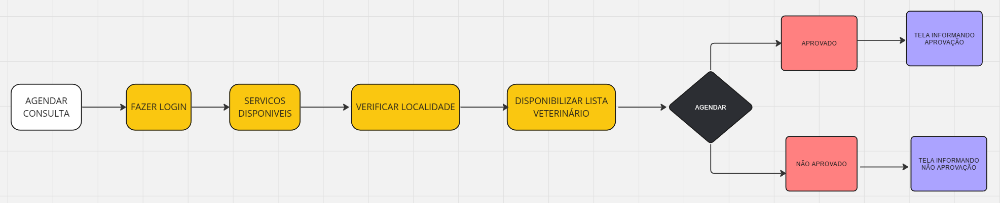
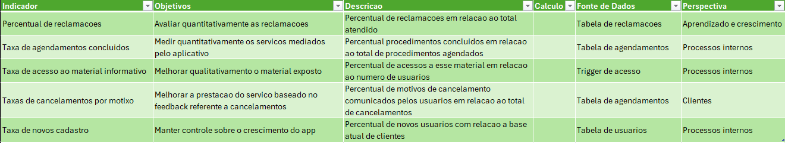

# Especificações do Projeto

## Perfis de Usuários

<table>
    <tbody>
        <tr>
            <th colspan="2">
                
<strong>Administrador da veterinária</strong>

            </th>
        </tr>
        <tr>
            <td>
                
<strong>Descrição:</strong>

            </td>
            <td>
Proprietário de clínica veterinária&nbsp;
</td>
        </tr>
        <tr>
            <td>
                
<strong>Necessidades:</strong>

            </td>
            <td>
                <ol>
                    <li>Criar um canal de comunicação que permita a exposição e fácil acesso de seus serviços pelos seus clientes finais&nbsp;</li>
                    <li>Visualizar os agendamentos referentes a equipe&nbsp;&nbsp;</li>
                </ol>
            </td>
        </tr>
    </tbody>
</table>

&nbsp;

<table>
    <tbody>
        <tr>
            <th colspan="2">
                
<strong>Médico veterinário</strong>

            </th>
        </tr>
        <tr>
            <td>
                
<strong>Descrição:</strong>

            </td>
            <td>
Prestador de serviço ou funcionário de uma clínica veterinária.&nbsp;
</td>
        </tr>
        <tr>
            <td>
                
<strong>Necessidades:</strong>

            </td>
            <td>
                <ol>
                    <li>Visualizar os agendamentos referentes ao mesmo&nbsp;&nbsp;</li>
                    <li>Confirmar/Negar agendamentos&nbsp;</li>
                    <li>Passar de forma pratica as orientações e a prescrição médica do tratamento para o cliente&nbsp;</li>
                </ol>
            </td>
        </tr>
    </tbody>
</table>

&nbsp;

<table>
    <tbody>
        <tr>
            <th colspan="2">
                
<strong>Tutor de animal de estimação </strong>

            </th>
        </tr>
        <tr>
            <td>
                
<strong>Descrição:</strong>

            </td>
            <td>
Tutor de animal de estimação que precisam de atendimento veterinário&nbsp;
</td>
        </tr>
        <tr>
            <td>
                
<strong>Necessidades:</strong>

            </td>
            <td>
                <ol>
                    <li>Acesso facilitado a uma plataforma que lista os servicos disponiveis&nbsp;&nbsp;</li>
                    <li>Possibilidade de agendamento para seu animal&nbsp;</li>
                    <li>Suporte pós atendimento&nbsp;</li>
                </ol>
            </td>
        </tr>
    </tbody>
</table>

&nbsp;

## Histórias de usuários

|
**Eu como …** 

**PERSONA** 
|
**Eu como …** 

**PERSONA** 
|**… quero/desejo …**   **FUNCIONALIDADE** |
**… para ....** 

**MOTIVO/VALOR** 
|
| :-: | :-: | :-: | :-: |
|H-01|administrador da clínica |Realizar meu login no aplicativo |para administrar meus serviços em um meio digital visando ampliar minha carteira de clientes |
|H-02|Qualquer usuário da aplicação|Visualizar os meus agendamentos . |Acompanhar e interagir com esse registro  |
|H-03|Médico Veterinário|Confirmar/Negar agendamentos de forma prática e comunicar quaisquer mudanças aos clientes |Manter a organização e a eficiência respeitando minha disponibilidade. |
|H-04|Médico Veterinário|Passar de forma prática as orientações e prescrições médicas para os clientes |Garantir a clareza e a precisão das informações ao auxiliar o administrador do meu paciente. |
|H-05|Tutor de animal de estimação |Realizar o meu cadastro no aplicativo |Ter acesso as facilidades do agendamento e informações uteis ao bem estar do meu pet |
|H-06|Tutor de animal de estimação |pesquisar informações sobre sintomas comuns em animais de estimação e dicas de adestramento / bem-estar |que eu possa garantir a saúde e o bem-estar do meu animal de estimação. |
|H-07|Tutor de animal de estimação |Agendar consultas para meu animal de forma simples e rápida |Garantir seu bem-estar sem complicações |
|H-08|Tutor de animal de estimação |Receber suporte pós-atendimento como informações sobre cuidados e acompanhamento |Assegurar a recuperação do meu pet por meio de uma adequada posologia e cumprimento da prescrição |
|H-09|Tutor de animal de estimação |pesquisar por servicos disponiveis|encontrar e realizar meu agendamento de forma ágil |
|H-10|Qualquer usuário da aplicação|atualizar minhas informacoes|mitigar possíveis erros e manter um cadastro atualizado |
|H-11|Qualquer usuário da aplicação|Verificar detalhes sobre meus agendamentos|me manter a par de possíveis atualizações |
|H-12|Tutor de animal de estimação |Consultar uma sessão clara de FAQ|facilitar a resolução de dúvidas/problemas mais frequentes   |

# Requisitos do Projeto

## Requisitos Funcionais

|**ID** |**Descrição** |**Prioridade** |
| :-: | :-: | :-: |
|RF-01 |Permitir o login do administrador da clínica veterinária  |ALTA |
|RF-02 |Possibilitar que os usuários do aplicativo visualizem os próprios agendamentos. |ALTA |
|RF-03 |Possibilitar que veterinários confirmem ou neguem agendamentos comunicando aos clientes. |ALTA |
|RF-04 |Habilitar veterinários a passar orientações e prescrições médicas de forma prática para os clientes. |ALTA |
|RF-05 |Oferecer aos Tutores de animais um meio de realizar cadastro no aplicativo/site. |ALTA |
|RF-06 |Permitir que Tutores de animais leiam dicas sobre bem-estar e adestramento. |ALTA |
|RF-07 |Habilitar agendamento e cancelamento online de consultas, vacinações e procedimentos para pets. |ALTA |
|RF-08 |Prover suporte pós-atendimento, incluindo informações sobre posologia e prescrição. |MÉDIA |
|RF-09 |A aplicação deve oferecer uma funcionalidade de selecionar serviços para permitir ao usuário realizar o agendamento.|ALTA |
|RF-10 |A aplicação deve permitir ao usuário atualizar as informações registradas no cadastro.|MEDIA |
|RF-11 |A aplicação deve permitir que o usuário verifique detalhes sobre seus agendamentos|ALTA |
|RF-12 |A aplicação deve permitir ao usuário visualizar uma sessão clara de FAQ e suporte ao usuário para dúvidas e problemas comuns.|BAIXA |

## Requisitos não funcionais

|**ID** |**Descrição** |**Prioridade** |
| :-: | :-: | :-: |
|RNF-01 |O site deve ser compatível com os principais navegadores: Edge, Mozilla Firefox, e Google Chrome. |ALTA |
|RNF-02 |Garantir um design responsivo para que o site seja acessível tanto em notebooks quanto em smartphones. |ALTA |
|RNF-03 |Implementar padrões de segurança para criação de senhas baseado no NIST SP 800-30. |ALTA |
|RNF-04 |Assegurar uma interface de usuário simples, adaptada para prover dark mode. |ALTA |
|RNF-05 |o site deve seguir um design minimalista para expor somente o necessário. |ALTA |

O projeto está restrito pelos itens apresentados na tabela a seguir.

|ID| Restrição                                             |
|--|-------------------------------------------------------|
|01| O projeto deverá ser entregue até o final do semestre |
|02| Não pode ser desenvolvido um módulo de backend        |
|03| Time terá uma grande curva de aprendizado             |

### Exemplo de Processo – Agendar Consulta

Como melhoria podemos considerar outras formas identificar o usuario em nossa plataforma considerando os impactos na experiencia do usuario

## Possiveis Indicadores de Desempenho

