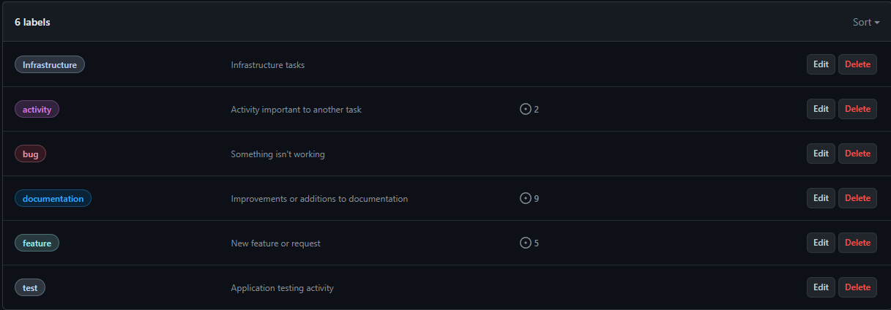

# Metodologia

## Gerenciamento de Projeto

O Scrum é um framework de desenvolvimento ágil que promove a colaboração em equipes de desenvolvimento. Ele enfatiza a entrega incremental, flexibilidade e interação constante entre os membros da equipe, servindo como uma estrutura para o desenvolvimento iterativo e adaptativo de produtos.

### Divisão de Papéis
<table>
    <tbody>
        <tr>
            <th colspan="2">
                
<strong>Equipe Vetease</strong>

            </th>
        </tr>
        <tr>
            <td>
                
<strong>scrum master</strong>

            </td>
            <td>
Thiago Murtinho&nbsp;
</td>
        </tr>
        <tr>
            <td>
                
<strong>dono do produto</strong>

            </td>
            <td>
Augusto César&nbsp;
</td>
        </tr>
        <tr>
            <td>
                
<strong>equipe de design</strong>

            </td>
            <td>
Isabella, Eduardo Porto&nbsp;
</td>
        </tr>
        <tr>
            <td>
                
<strong>equipe de desenvolvimento</strong>

            </td>
            <td>
Beatriz Rodrigues, Augusto Cesar, Thiago Murtinho, Isabella, Eduardo Porto&nbsp;
</td>
        </tr>
    </tbody>
</table>

&nbsp;

### Processo

Para a organização, acompanhamento do andamento do projeto, execução de tarefas status de desenvolvimento da solução, a equipe está utilizando o GitHub

- Backlog: tarefas para serem trabalhadas, todas as atividades do projeto são incorporadas nessa lista
- To do: sprint backlog que está sendo trabalhado 
- ⁠In progress : tarefas que estão em andamento
- ⁠Done: tarefas finalizadas que passam por controle, prontas a serem entregues 

O board kanban referente ao acompanhamento do projeto esta disponivel no link a seguir e esta representado, no estado atual, na figura abaixo:
https://github.com/orgs/ICEI-PUC-Minas-PMV-ADS/projects/1038

### Etiquetas
As tarefas são, ainda, etiquetadas em função da natureza da atividade e seguem o seguinte esquema de cores/categorias:

### Ferramentas

| Objetivo | Ferramenta | link de acesso               |
|--------------------|--------------------------------------------------------------------------------|----------------------------------------|
|Repositório de código fonte | GitHub | https://github.com/ICEI-PUC-Minas-PMV-ADS/pmv-ads-2024-e1-proj-web-t15-vetease/tree/main/src  |
|Codificação  | Visual studio code | n/a |
|Projeto de interface | Figma | https://www.figma.com/ |
|Gerenciamento do projeto  | GitHub | https://github.com/orgs/ICEI-PUC-Minas-PMV-ADS/projects/1038|
