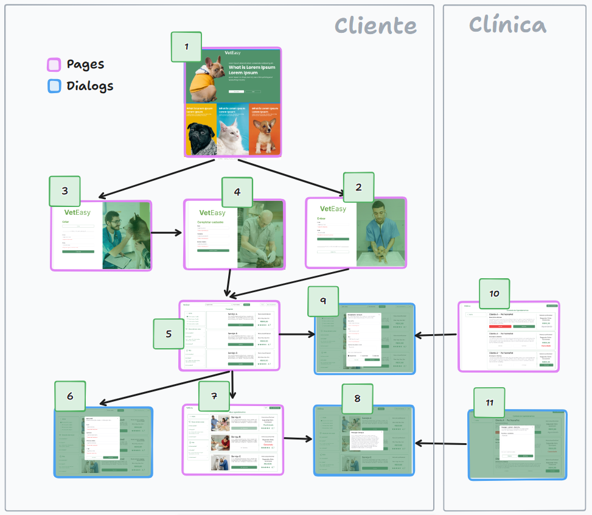

# Projeto de Interface
Aqui precisa de um texto de introdução ao trabalho de construção da interface, ela foi feita no Figma e segue o conceito de UI minimalista, com cores claras e poucos elementos na tela. Este design visa proporcionar uma experiência de usuário fluida e intuitiva, reduzindo a sobrecarga visual e melhorando a acessibilidade do site. A escolha do minimalismo também reflete a abordagem moderna do projeto, focando na funcionalidade sem sacrificar a estética.

Durante o desenvolvimento, a equipe focou em manter uma coerência visual em todas as telas, garantindo que os usuários sintam uma transição suave à medida que navegam pelas diferentes funcionalidades. As cores foram escolhidas com base em sua capacidade de criar um ambiente acolhedor e tranquilo, que é essencial para sites que lidam com serviços de saúde e bem-estar animal. Além disso, a tipografia foi cuidadosamente selecionada para garantir legibilidade e apresentar informações de maneira clara e concisa.

## User Flow

Essa parte tem uma imagem com fluxo de navegação do usuário, que mostra como ele pode navegar pelo site, desde a tela inicial até a finalização de um agendamento. Este diagrama visual é crucial para entender o percurso intuitivo proposto pelo design da interface, evidenciando a facilidade com que o usuário pode acessar as diversas funcionalidades disponíveis. O fluxo de navegação foi pensado para minimizar o número de cliques necessários para realizar tarefas essenciais, aumentando assim a eficiência e satisfação do usuário durante o uso do site.

O diagrama também serve como uma ferramenta vital para os desenvolvedores e designers durante a fase de criação e ajustes da interface, permitindo que ajustes sejam feitos de forma proativa para melhorar a interatividade e funcionalidade. A visualização clara do percurso que o usuário fará no site ajuda a equipe a identificar e resolver possíveis gargalos ou complicações no design antes que o site seja lançado, garantindo uma experiência de usuário final agradável e sem empecilhos.

## Protótipo

<h3><b>Tela 1 - Home page</b></h3>

A tela de home page apresenta banners que remetem para as páginas de Livros, Tutoriais e Cadastro, além de incluir depoimentos de estudantes e uma breve descrição sobre o projeto. Esta tela serve como ponto central de navegação e introdução ao site, fornecendo uma visão geral e acesso rápido às principais áreas do website.

<h3><b>Tela 2 - Login</b></h3>

Esta tela contém dois campos de entrada para email e senha, um botão para entrar no sistema e outro para criar uma nova conta.

  

<h3><b>Tela 3 - Cadastro</b></h3>

Esta tela apresenta um formulário com campos para email e senha, além de um botão para criar conta e um link para a tela de login.

<h3><b>Tela 4 – Completar cadastro</b></h3>

Esta tela inclui um formulário para completar o cadastro com campos para nome, sobrenome, endereço completo e um botão para confirmar os dados inseridos.

<h3><b>Tela 5 – Pesquisa</b></h3>

Dividida em duas seções: à esquerda, caixas de seleção para cidades, dicas de bem-estar e FAQs; à direita, uma lista de serviços disponíveis com preço, descrição, datas disponíveis, nota de avaliação e um botão para agendar.

  

<h3><b>Tela 6 – Perfil</b></h3>

Esta tela exibe um modal com título e descrição, contendo um formulário para editar dados pessoais como nome, sobrenome, endereço completo e email, além de botões para cancelar ou confirmar as alterações.

 

<h3><b>Tela 7 – Meus agendamentos</b></h3>

Contém três caixas à esquerda com opções para voltar, acessar dicas de bem-estar e FAQs. À direita, lista os agendamentos com informações sobre status (confirmado, cancelado, atendido), descrição, datas, nome do profissional e botão para ver o tratamento.

 

<h3><b>Tela 8 – Ver prescrição</b></h3>

Apresenta um modal com título e descrição da prescrição médica, permitindo uma visualização clara do tratamento prescrito.

 

<h3><b>Tela 9 – Agendamento</b></h3>

Exibe um modal para agendar consultas, com campos para nome do pet, peso, raça e descrição do problema. Inclui opções de checkbox para selecionar dias disponíveis e botões para cancelar ou confirmar o agendamento.

 

<h3><b>Tela 10 – Controle de agendamentos</b></h3>

Com caixas à esquerda para voltar, dicas de bem-estar e FAQs. À direita, uma lista de agendamentos com status, descrição de sintomas, nome do cliente, nome do pet, opções para confirmar ou cancelar, nome do profissional, data da semana, data completa, valor e status final do agendamento.

  

<h3><b>Tela 11 – Cadastro de prescrição</b></h3>

Esta tela apresenta um modal para cadastro de prescrições, com um campo de texto para inserir informações e botões para confirmar ou cancelar a entrada.

